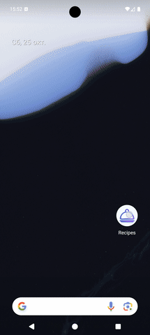
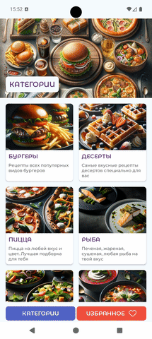

# Приложение "Рецепты" / Recipes App (Jetpack Compose)

### 1. Описание

Это Android-приложение для просмотра кулинарных рецептов, полностью написанное на **Jetpack Compose**. Проект демонстрирует современный подход к разработке с использованием **Clean Architecture**, асинхронности и принципа **Offline-first**.

**Ключевые возможности:**

*   **Просмотр категорий:** Главный экран отображает список категорий блюд, загружаемых с удаленного сервера.
*   **Каталог рецептов:** Для каждой категории доступен список рецептов с изображениями и названиями.
*   **Детальный экран рецепта:** Полная информация о рецепте, включая список ингредиентов, пошаговый способ приготовления и изображение.
*   **Калькулятор порций:** Интерактивный слайдер для пересчета количества ингредиентов в зависимости от выбранного числа порций.
*   **Избранное:** Возможность добавлять рецепты в избранное и просматривать их на отдельном экране.
*   **Offline-first:** Данные, полученные с сервера, кэшируются в локальной базе данных **Room**, что позволяет пользоваться приложением даже без доступа к сети.

Приложение спроектировано с использованием **Single-Activity** подхода и **Jetpack Navigation** для навигации между экранами.

### 2. Используемые технологии

*   **Архитектура и структура:**
    *   Clean Architecture (Data, Domain, Presentation)
    *   MVVM
    *   Repository Pattern и UseCases
    *   Hilt

*   **Пользовательский интерфейс (UI):**
    *   Jetpack Compose
    *   Material Design 3
    *   Jetpack Navigation
    *   Coil

*   **Работа с данными и асинхронность:**
    *   Kotlin Coroutines & Flow
    *   Retrofit и OkHttp
    *   Room
    *   Kotlinx.Serialization

*   **Тестирование и качество кода:**
    *   JUnit & MockK
    *   Turbine
    *   Detekt

### 3. Пример использования

1.  **Просмотр категорий:** Главный экран отображает список категорий блюд. Для обновления данных на любом экране со списком реализована функция "pull-to-refresh".

    

2.  **Список рецептов:** Нажмите на любую категорию, чтобы перейти к списку рецептов, относящихся к ней.

    

3.  **Детали рецепта и калькулятор порций:** Выберите рецепт, чтобы открыть детальный экран. Здесь вы можете двигать ползунок, чтобы изменить количество порций, и список ингредиентов автоматически пересчитается в реальном времени.

    

4.  **Работа с избранным:** Добавляйте рецепты в избранное нажатием на иконку сердца. Они появятся на отдельной вкладке, где их можно просмотреть или удалить.

    

### 4. Контакты

*   **Имя:** Павлушин Станислав
*   **Email:** [pavlushinsa18@gmail.com](mailto:pavlushinsa18@gmail.com)
*   **Telegram:** [@Untamo](https://t.me/Untamo)

---

### 1. Description

This is an Android application for browsing culinary recipes, built entirely with **Jetpack Compose**. The project demonstrates a modern approach to development using **Clean Architecture**, asynchronous programming, and an **Offline-first** principle.

**Key Features:**

*   **Category Browsing:** The main screen displays a list of dish categories loaded from a remote server.
*   **Recipe Catalog:** Each category contains a list of recipes with their corresponding images and titles.
*   **Detailed Recipe View:** A comprehensive screen with full recipe details, including a list of ingredients, step-by-step cooking instructions, and an image.
*   **Servings Calculator:** An interactive slider allows users to recalculate ingredient quantities based on the selected number of servings.
*   **Favorites:** Users can add recipes to a favorites list and view them on a separate screen.
*   **Offline-First:** Data fetched from the server is cached in a local **Room** database, allowing the application to be used even without a network connection.

The application is designed using a **Single-Activity** approach with **Jetpack Navigation** for handling navigation between screens.

### 2. Technologies

*   **Architecture & Structure:**
    *   Clean Architecture (Data, Domain, Presentation)
    *   MVVM
    *   Repository Pattern & UseCases
    *   Hilt

*   **User Interface (UI):**
    *   Jetpack Compose
    *   Material Design 3
    *   Jetpack Navigation
    *   Coil

*   **Data & Concurrency:**
    *   Kotlin Coroutines & Flow
    *   Retrofit & OkHttp
    *   Room for local database
    *   Kotlinx.Serialization

*   **Testing & Code Quality:**
    *   JUnit & MockK
    *   Turbine
    *   Detekt

### 3. Usage Example

1.  **Category Browsing:** The main screen displays a list of dish categories. Pull-to-refresh is available on any list screen to update the data.

    

2.  **Recipe List:** Tap on any category to navigate to a list of recipes within it.

    

3.  **Recipe Details & Servings Calculator:** Select a recipe to open its detail screen. Here, you can use the interactive slider to adjust the number of servings, and the ingredient list will update automatically in real-time.

    

4.  **Favorites Flow:** Add recipes to your favorites by tapping the heart icon. They will appear on a separate tab where you can view or remove them.

    

### 4. Contacts

*   **Name:** Pavlushin Stanislav
*   **Email:** [pavlushinsa18@gmail.com](mailto:pavlushinsa18@gmail.com)
*   **Telegram:** [@Untamo](https://t.me/Untamo)